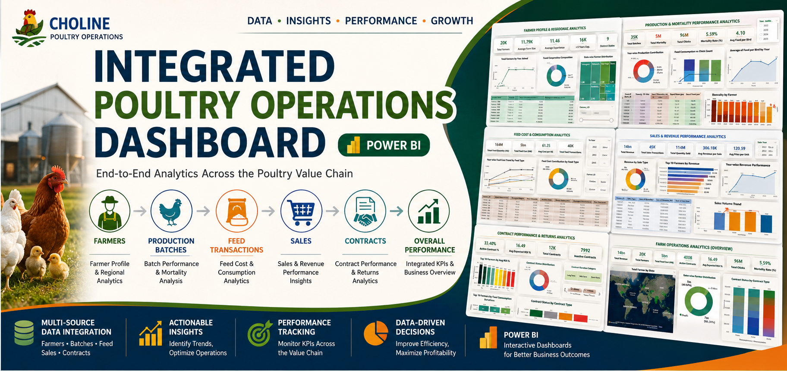
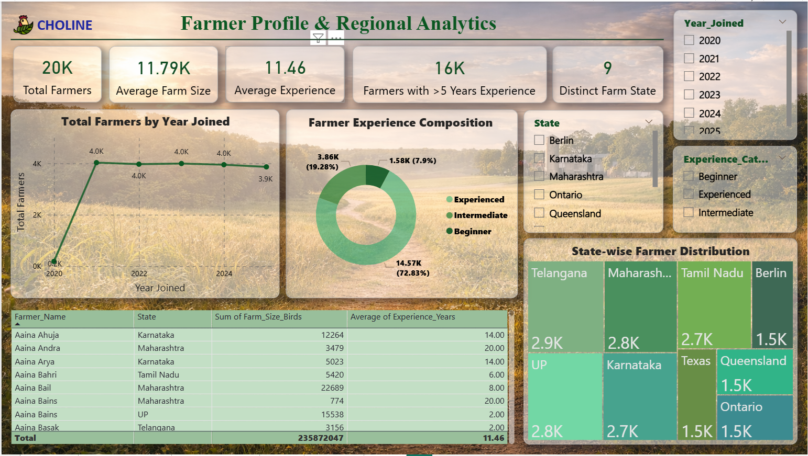
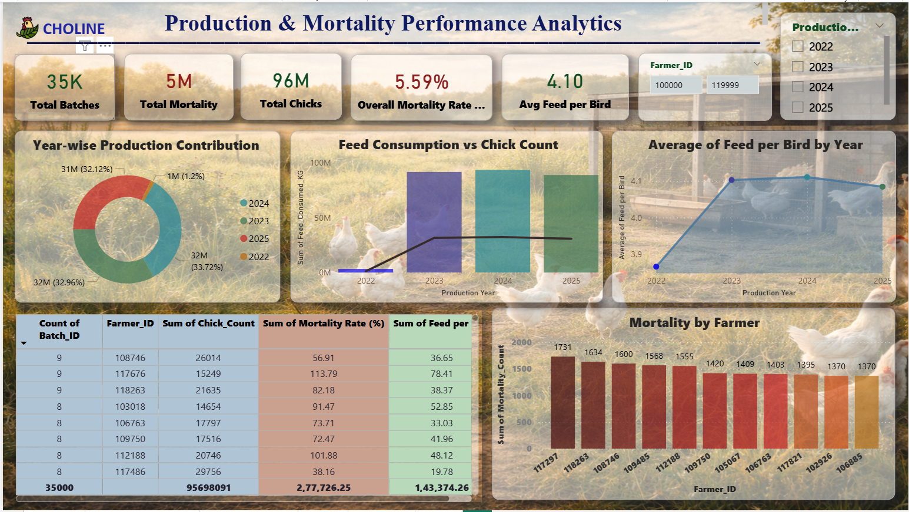
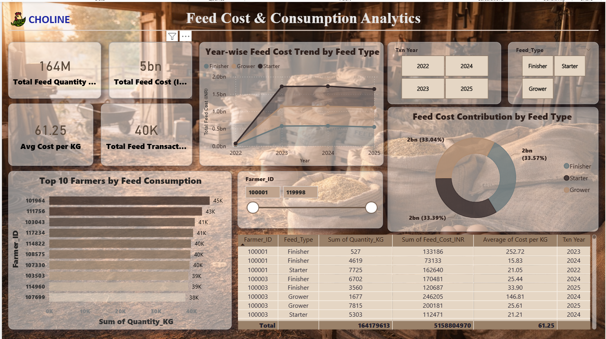
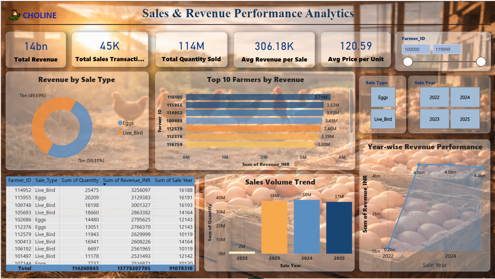
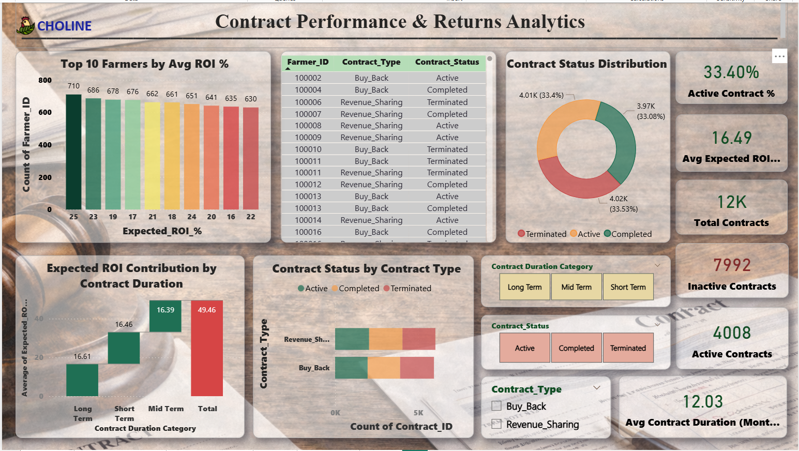
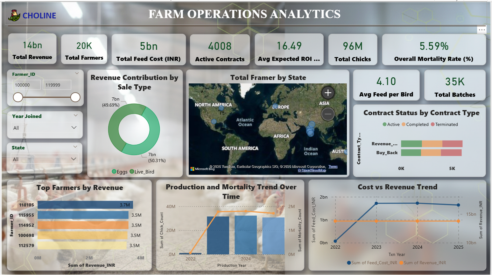

<p align="center">
  
</p>

<h1 align="center">🐔 Integrated Poultry Operations Dashboard</h1>

<p align="center">
  An end-to-end Power BI analytics solution integrating farmer, production, feed, sales, and contract data into interactive dashboards for monitoring poultry operations and business performance.
</p>

<p align="center">


</p>

---

## 📖 Project Overview

The **Integrated Poultry Operations Dashboard** is a Power BI business intelligence project developed to provide a consolidated view of poultry operations across multiple business areas.

The solution integrates data related to:

- 👨‍🌾 Farmers
- 🐔 Production Batches
- 🌾 Feed Transactions
- 🛒 Sales
- 📄 Contracts

The project transforms operational data into interactive dashboards that help analyze production performance, mortality, feed consumption, sales revenue, contract performance, and overall farm operations.

---

## 🎯 Project Objectives

- Analyze farmer profiles and regional distribution.
- Monitor production and mortality performance.
- Analyze feed consumption and feed costs.
- Track sales volume and revenue performance.
- Evaluate contract status and expected returns.
- Provide an integrated overview of farm operations.
- Enable interactive analysis using Power BI filters and slicers.
- Support data-driven operational and business decisions.

---

## 🗂️ Data Sources

The project uses an Excel workbook as the primary data source.

### Source Workbook

```text
CLOLINE_Client_Project_Data.xlsx
```

The source data is organized into the following business areas:

| Data Area | Purpose |
|---|---|
| Farmers | Farmer profile, location, farm size, experience, and joining information |
| Production_Batches | Batch production, chick count, mortality, and feed-related production metrics |
| Feed_Transactions | Feed quantity, feed type, feed cost, and transaction year |
| Sales | Sale type, quantity sold, revenue, farmer, and sale year |
| Contracts | Contract type, status, duration, and expected ROI |

---

# 📊 Dashboard Pages

The Power BI report contains **six analytical pages**.

---

## 1️⃣ Farmer Profile & Regional Analytics

This page focuses on the farmer population and regional distribution.

### Key Metrics

- Total Farmers
- Average Farm Size
- Average Experience
- Farmers with more than 5 years of experience
- Number of distinct states

### Analysis Includes

- Farmers by year joined
- Farmer experience composition
- State-wise farmer distribution
- Farmer-level details
- Regional analysis

### Interactive Filters

- Year Joined
- State
- Experience Category

---

## 2️⃣ Production & Mortality Performance Analytics

This page analyzes poultry production performance and mortality.

### Key Metrics

- Total Batches
- Total Mortality
- Total Chicks
- Overall Mortality Rate
- Average Feed per Bird

### Analysis Includes

- Year-wise production contribution
- Feed consumption versus chick count
- Average feed per bird by year
- Mortality by farmer
- Batch-level production information

### Interactive Filters

- Production Year
- Farmer ID

---

## 3️⃣ Feed Cost & Consumption Analytics

This page focuses on feed usage and associated costs.

### Key Metrics

- Total Feed Quantity
- Total Feed Cost
- Average Cost per KG
- Total Feed Transactions

### Analysis Includes

- Year-wise feed cost trend by feed type
- Feed cost contribution by feed type
- Top farmers by feed consumption
- Farmer-level feed transaction details
- Cost per KG analysis

### Interactive Filters

- Transaction Year
- Feed Type
- Farmer ID

---

## 4️⃣ Sales & Revenue Performance Analytics

This page provides insights into sales activity and revenue generation.

### Key Metrics

- Total Revenue
- Total Sales Transactions
- Total Quantity Sold
- Average Revenue per Sale
- Average Price per Unit

### Analysis Includes

- Revenue by sale type
- Top farmers by revenue
- Year-wise revenue performance
- Sales volume trend
- Farmer-level sales information

### Interactive Filters

- Farmer ID
- Sale Type
- Sale Year

---

## 5️⃣ Contract Performance & Returns Analytics

This page analyzes contract activity and expected returns.

### Key Metrics

- Active Contract Percentage
- Average Expected ROI
- Total Contracts
- Inactive Contracts
- Active Contracts
- Average Contract Duration

### Analysis Includes

- Top farmers by average ROI
- Contract status distribution
- Expected ROI contribution by contract duration
- Contract status by contract type
- Contract duration analysis

### Interactive Filters

- Contract Duration Category
- Contract Status
- Contract Type

---

## 6️⃣ Farm Operations Analytics

The final dashboard provides an integrated overview of the poultry operation.

### Key Metrics

- Total Revenue
- Total Farmers
- Total Feed Cost
- Active Contracts
- Average Expected ROI
- Total Chicks
- Overall Mortality Rate
- Average Feed per Bird
- Total Batches

### Analysis Includes

- Revenue contribution by sale type
- Farmer distribution by state
- Contract status by contract type
- Top farmers by revenue
- Production and mortality trends
- Cost versus revenue trends

### Interactive Filters

- Farmer ID
- Year Joined
- State

---

# 🔗 End-to-End Poultry Value Chain

The dashboard connects different operational areas into one analytical flow:

```text
Farmers
   ↓
Production Batches
   ↓
Feed Transactions
   ↓
Sales
   ↓
Contracts
   ↓
Overall Farm Performance
```

This provides a consolidated view of the poultry business rather than analyzing each operational area independently.

---

# 📈 Key Performance Areas

The dashboard focuses on five major performance dimensions:

### 👨‍🌾 Farmer Performance

- Farmer demographics
- Experience
- Farm size
- Regional distribution

### 🐔 Production Performance

- Batch volume
- Chick production
- Mortality
- Feed per bird

### 🌾 Feed Performance

- Feed consumption
- Feed cost
- Cost per KG
- Feed type contribution

### 💰 Sales Performance

- Revenue
- Quantity sold
- Sale type
- Revenue trends
- Top-performing farmers

### 📄 Contract Performance

- Contract status
- Contract type
- Contract duration
- Expected ROI
- Active and inactive contracts

---

# 🛠️ Tools & Technologies

| Category | Technology |
|---|---|
| Business Intelligence | Microsoft Power BI |
| Data Source | Microsoft Excel |
| Data Visualization | Power BI |
| Data Transformation | Power Query |
| Data Modeling | Power BI Data Model |
| Analysis | DAX |
| Reporting | Interactive Power BI Dashboards |

---

# 📸 Dashboard Preview

## Farmer Profile & Regional Analytics

<p align="center">
  
</p>

---

## Production & Mortality Performance Analytics

<p align="center">
  
</p>

---

## Feed Cost & Consumption Analytics

<p align="center">
  
</p>

---

## Sales & Revenue Performance Analytics

<p align="center">
  
</p>

---

## Contract Performance & Returns Analytics

<p align="center">
  
</p>

---

## Farm Operations Analytics

<p align="center">
  
</p>

---

# 📂 Repository Structure

```text
Integrated-Poultry-Operations-Dashboard
│
├── Integrated-Poultry-Operations-Dashboard.pbix
├── CLOLINE_Client_Project_Data.xlsx
├── README.md
├── LICENSE
├── .gitignore
│
├── assets/
│   └── project-banner.png
│
└── screenshots/
    ├── farmer.png
    ├── production-batches.png
    ├── feed-transactions.png
    ├── sales.png
    ├── contracts.png
    └── final-dashboard.png
```

---

# 🚀 How to Use

### 1. Download the Repository

Clone the repository:

```bash
git clone https://github.com/pranaliundre-gif/Integrated-Poultry-Operations-Dashboard.git
```

### 2. Open the Power BI File

Open:

```text
Integrated-Poultry-Operations-Dashboard.pbix
```

using **Microsoft Power BI Desktop**.

### 3. Data Source

The report uses:

```text
CLOLINE_Client_Project_Data.xlsx
```

as its source data.

If Power BI asks for the source file location, update the Excel file path in the data source settings.

### 4. Explore the Dashboard

Navigate through the six report pages and use the available filters and slicers to perform interactive analysis.

---

# 💡 Business Value

The dashboard provides a centralized analytical view of poultry operations and can help users:

- Monitor operational performance.
- Identify production and mortality trends.
- Understand feed consumption and cost patterns.
- Track revenue and sales performance.
- Evaluate contract performance.
- Compare farmer-level performance.
- Monitor key operational KPIs.
- Make data-driven business decisions.

---

# 🔮 Future Enhancements

Potential improvements include:

- Automated data refresh from a centralized database.
- Real-time operational monitoring.
- Advanced profitability analysis.
- Farmer performance scoring.
- Predictive mortality analysis.
- Feed demand forecasting.
- Revenue forecasting.
- Contract ROI prediction.
- Power BI Service deployment with scheduled refresh.
- Role-based dashboard access.

---

# 🎓 Skills Demonstrated

This project demonstrates practical experience in:

- Power BI Dashboard Development
- Business Intelligence
- Data Analytics
- Power Query
- DAX
- Data Modeling
- KPI Development
- Data Visualization
- Interactive Slicers
- Business Reporting
- Operational Analytics
- Sales & Revenue Analysis
- Production Analytics
- Cost Analysis

---

# 👩‍💻 Author

**Pranali Undre**

Information Technology Student

### Areas of Interest

- Data Analytics
- Business Intelligence
- Data Science
- Machine Learning
- Artificial Intelligence

### GitHub

https://github.com/pranaliundre-gif

### LinkedIn

_Add your LinkedIn profile URL here._

---

# ⭐ Support

If you found this project useful or interesting, consider giving the repository a ⭐ on GitHub.

---

# 📜 License

This project is licensed under the **MIT License**.